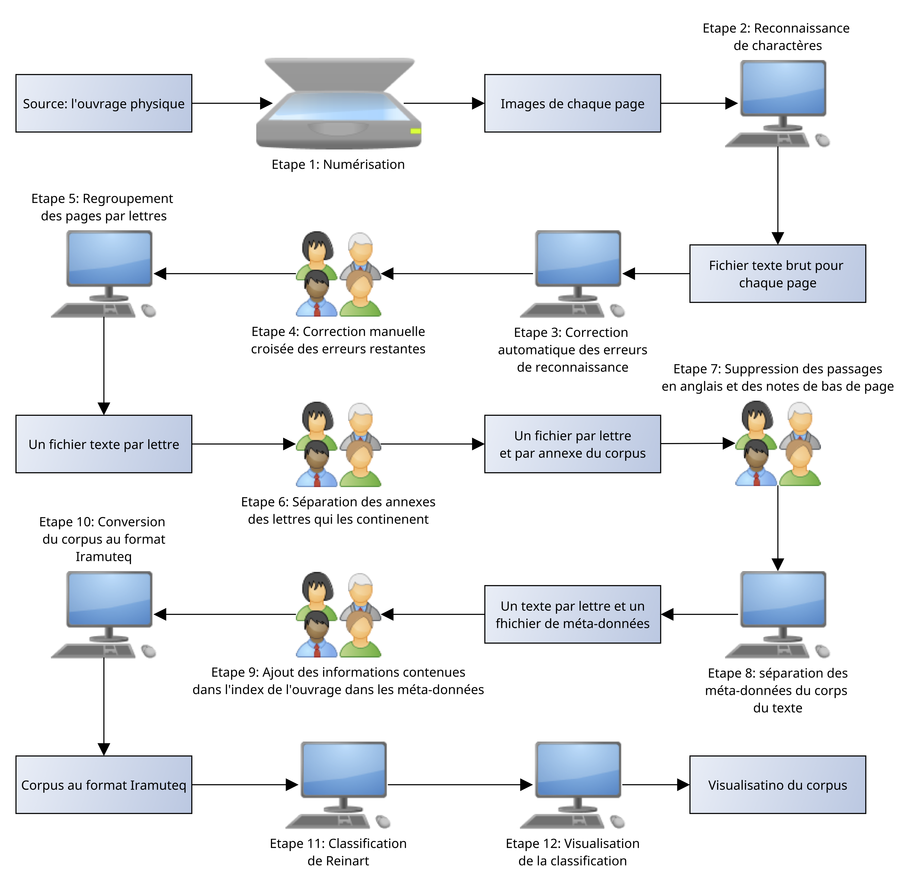

# Méthodologie

## Méthode adoptée

Pour pouvoir traiter la grande quantité d'informations à notre disposition nous avons choisi utiliser l'outil informatique. Il s'agit d'une méthode rarement utilisée dans ce contexte, c'est pour cela que nous allons décrire de façon précise la méthodologie que nous avons suivie.

Dans le traitement informatique de la langue naturelle la méthode classique est d'utiliser une chaîne de traitement. C'est à dire que l'on décompose le travail à effectuer en petites tâches plus simples (en suivant le concept de travail à la chaîne). Chaque tâche utilise le résultat de la précédente et son résultat servira à la prochaine tâche. La première tâche est la numérisation et la dernière est la visualisation. 

De par la nature ambiguë de la langue naturelle, chaque étape du processus ne peut donner un résultat totalement exact. Par conséquent chaque tâche introduit son lot d'imprécisions qui s'accumulent tout au long de la chaîne de traitement. Plus problématique, une tâche trop imprécise au début du traitement introduit des erreurs qui, amplifiés par la suite du processus, ont un effet dévastateur sur le résultat final. C'est pour cela que nous avons porté une attention toute particulière à la numérisation et effectué beaucoup de corrections et nettoyages manuels du texte.

Le but de tout ce processus est, à partir d'un livre (physique), et de façon assistée, extraire les thématiques principales de l'ouvrage, puis de les visualiser afin d'en tirer une interprétation historique. 

Le schéma \ref{pipeline} résume la chaîne. On peut distinguer les tâches qui ont été réalisées manuellement et celles qui ont bénéficié d'assistance informatique.

## Les parties cruciales de la chaîne de traitement

### Numérisation

La première tâche que nous avons eu à réaliser est la numérisation, c'est à dire obtenir une image pour chaque page de l'ouvrage. Nous avons considéré plusieurs possibilités pour mener à bien cet objectif. Le premier fut Microsoft Office Lens [^1], une application pour smartphones. Son avantage principal est sa facilité d'utilisation. La seconde fut d'utiliser des scanners haute résolution. Plus long à utiliser, ils offrent cependant une qualité d'image supérieure. Afin de maximiser la qualité des premières étapes de la chaîne de traitement c'est la deuxième option que nous avons choisi.

### Reconnaissance de caractères

Maintenant que nous avons à disposition une image pour chaque page du livre, il nous faut en extraire du texte pour pouvoir traiter le corpus efficacement de façon automatisée. Pour ce faire, nous avons utilisé l'outil tesseract[^2]. Il est considéré comme le choix le plus précis parmi les solutions gratuites. Pourtant, le résultat obtenu n'était pas à la hauteur de nos attentes. Par exemple, les noms propres n'étant pas dans le dictionnaire de tesseract: ils étaient mal orthographiés dans la grande majorité des cas. Les tableaux, non reconnus par tesseract, ont entraîné de nombreuses erreurs de mise en page, dans les rapports chiffrés notamment. Pour réduire les imprécisions au minimum et augmenter la qualité des données fournies aux tâches suivantes, nous avons décidé d'effectuer une correction manuelle des erreurs. Nous en avons profité pour supprimer les passages en anglais et les notes de bas de pages. La raison pour laquelle nous avons enlevé les passages en anglais est simple. En effet, en règle générale, les outils du traitement de la langue naturelle sont conçus pour une langue bien particulière, il aurait donc été très compliqué de gérer à la fois la partie anglaise et la partie française. Nous avons également décidé d'enlever les notes de bas de page car elles sont hors de leur contexte original (à la fin de la page), pour pouvoir en tirer parti il aurait pu falloir les rattacher à leur contexte et cela n'était pas possible car la reconnaissance de caractères n'arrive pas à détecter correctement les nombres en indices (qui font référence à la note de bas de page en question).

### Séparation des lettres et extraction des méta-données

Les en-têtes des lettres nous donnent des informations très intéressantes. Elles contiennent, dans le meilleur des cas, l'auteur, le destinataire, la date, le lieu, et le type de correspondance (Lettre, télégramme, etc). Le nombre de lettres dans le corpus étant relativement faible, baser notre travail uniquement sur les méta-données nous aurait laissé avec une quantité de données trop faible. Nous avons donc dû traiter le corpus lui même. La première étape fut de séparer le texte en lettres. En effet, dans la mesure où les lettres peuvent être très espacées temporellement, il est donc très probable qu'elles traitent de sujets différents, ou du moins, le fasse dans un contexte historique différent. Nous avons donc jugé cette séparation judicieuse.

### Tentatives infructueuses 

En possession du corpus nettoyé et des méta-données, nous avons tenté de nombreuses approches qui se sont révélées malheureusement infructueuses. Nous avions en tête d'analyser les relations entre les différentes personnalités présentes dans le corpus et d'observer comment elles évoluent au cours du temps. Pour cela, nous avions besoin de trouver dans le texte l'ensemble des groupes de mots faisant référence à des personnes. Ceci est une tâche courante dans le domaine du traitement de la langue et de nombreux outils existent pour le faire. Cependant ils sont en très large majorité destinés à manipuler la langue anglaise. Il y a actuellement peu de programmes capables de le faire pour le français. Nous avons essayé tous ceux dont nous avions connaissance mais malheureusement les résultats n'étaient pas au rendez-vous avec un taux de réussite très faible. Nous avons également tenté de réaliser la même tâche avec les lieux (pays, villes, régions etc..) mais la faible quantité d'occurrences et les écarts temporels très variables entre les différentes lettres ont rendu le résultat impossible à interpréter.

### Reconnaissance manuelle des entités

Dans la mesure où les outils de reconnaissance d'entités nommées (c'est à dire trouver les personnes, lieux, organisations dans un texte) n'étaient pas suffisamment efficaces et que ces informations nous semblaient indispensables, nous nous sommes résignés à effectuer cette tâche manuellement (pour les personnalités uniquement) en utilisant l'index des noms propres présent à la fin de l'ouvrage. Malheureusement ces occurrences n'étaient pas suffisantes pour pouvoir donner une interprétation historique satisfaisante. Nous avons donc décidé de joindre toutes les informations que nous avions à dispositions (dates, personnes, lieux, destinataire, etc), et de les importer dans un logiciel appelé Iramuteq[^3]. 

### Iramuteq

Iramuteq est un logiciel d'analyse de corpus. Pour visualiser notre texte nous avons décidé d'utiliser la méthode Alceste[^4]. Cette méthode est composée de plusieurs sous-étapes. Dans un premier temps le texte est découpé en petit segments. Ensuite chaque segment est traité individuellement afin de supprimer les mots qui sont porteurs de peu de sens (déterminants, mots de liaison etc) et chaque mot est réduit à sa racine pour regrouper les mots selon leur sens et non selon leur forme grammaticale. Ces segments sont ensuite analysés à l'aide de méthodes statistiques afin de pouvoir les classer, c'est à dire leur associer une catégorie. Pour finir une hiérarchie de classe est déterminée. C'est à partir de cette hiérarchie que nous avons basé notre visualisation, qui, elle-même, nous a permis de faire une interprétation historique du corpus.

[^1]: Disponible ici: [https://www.microsoft.com/en-us/store/apps/office-lens/9wzdncrfj3t8](https://www.microsoft.com/en-us/store/apps/office-lens/9wzdncrfj3t8)
[^2]: Disponible ici: [https://github.com/tesseract-ocr/tesseract](https://github.com/tesseract-ocr/tesseract) 
[^3]: Site web du logiciel [http://www.iramuteq.org/](http://www.iramuteq.org/)
[^4]: Article à ce sujet: [https://sociologie.revues.org/312#ftn2]
